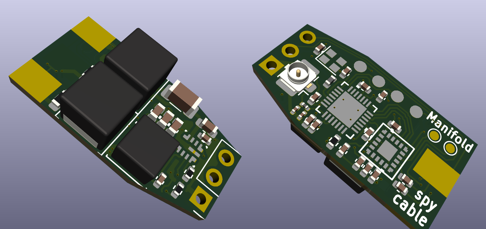

# Manifold Spycable  
**_Work in Progress_**

**Manifold Spycable** is a project that aims to explore the boundaries of miniaturized embedded electronics by integrating a fully functional computer within a standard XLR connector. 

---

## Overview  
The Manifold Spycable comprises several components:

### 1. **The Spycable Device**  
- A single PCB computer designed to fit inside a standard XLR connector (such as the Neutrik NC3MMX or similar) - similar form factor as [Manifold PAT-MAT](https://github.com/manifold-engineering/pat-mat)
- Powered directly from standard 48V phantom power, commonly used in professional audio equipment.  
- Equipped with:  
  - **TI PCM1820/1821/1822 ADC** for audio data conversion.  
  - **ESP8685 MCU** based on the RISC-V ESP32-C3 core with Wi-Fi capability.  
- Features a **u.FL IPEX connector** for a Wi-Fi antenna. A detailed evaluation of compatible antennas (e.g., Fractus Compact Reach Xtend with coax cable) will be added later.  
- Designed to allow space for a microphone cable to pass through, enabling the creation of standard-looking XLR cables capable of audio data transmission and recording.

### 2. **Firmware**  
Custom firmware for the ESP8685 to handle audio data acquisition from the ADC and real-time data transmission over Wi-Fi.

### 3. **Receiver Software**  
Software for standaerd computer systems to process the incoming audio data streams. Possible functions might include audio file recording and real-time playback.

---
### Development Stage  
This project is in its **early development stage**. Currently, only the hardware design for the device is ready. Firmware and receiver software development are still in progress.

**Note**: This project may have potential data security implications if used in unintended ways. However, it is intended purely for educational, experimental, and demonstration purposes.  

---

## Licensing  
This project is licensed under the **MIT License**. See the `LICENSE` file for more information.

---

## Future Development  
Stay tuned for:  
- Firmware updates for the embedded ESP8685.  
- Antenna recommendations and performance benchmarks.  
- Receiver software to enable audio recording and playback.

---
